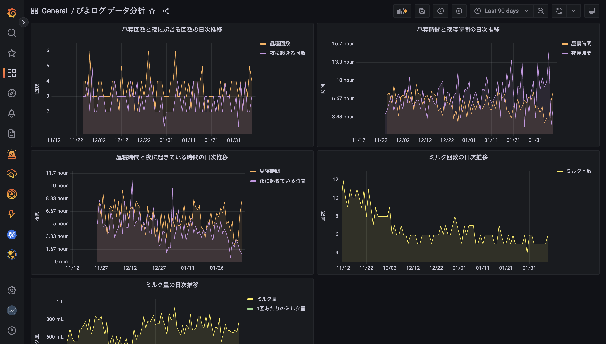

# piyolog-analytics

ぴよログのデータ分析

## 技術スタック

- Grafana Cloud
  - Grafana による分析ダッシュボード
- PlanetScale
  - Grafana のデータソース（MySQL）
- Google Drive
  - ぴよログからエクスポートしたデータの一時的な格納先
- Python
  - ぴよログからエクスポートしたデータの加工・DB への登録スクリプト

## 分析の流れ

1. 毎日 12:00 までに「ぴよログ」アプリから前日のデータをエクスポートする  
   エクスポートしたデータは Google Drive にテキストファイルとして保存する  
   ※この操作は自動化できないため、毎日手動で実行する必要がある
2. Google Drive 上のテキストファイルからデータを加工して PlanetScale（MySQL）に登録する Python スクリプトを実行する  
   ※このスクリプトは GitHub Actions で毎日 12:00 に実行する
3. Grafana から PlanetScale（MySQL）に接続してデータを分析する

## 参考

- [ぴよログのエクスポートデータを見える化する](https://qiita.com/kaji-tan/items/e1d6b4893dca8708a9ad)
- [ぴよログのデータから育児のつらさを可視化してみた](https://qiita.com/yakipudding/items/11223f12a843e4399300)
